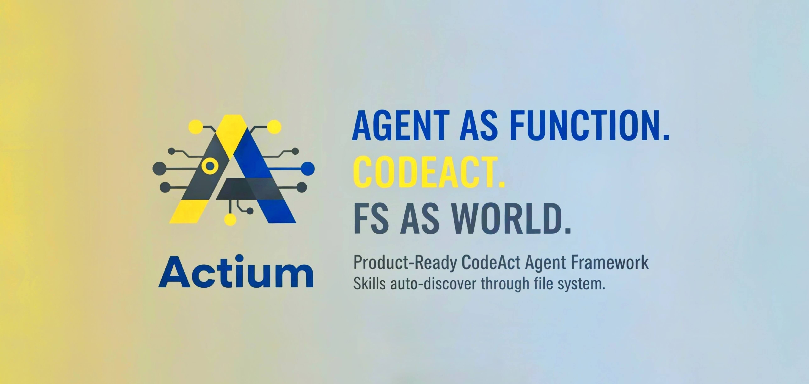

# Actium



**Agent As Function. CodeAct. FS as World.**

Actium is a **Product-Ready CodeAct Agent Framework** that lets you define intelligent agents as simple functions. With **Skills** that auto-discover through the file system, agents explore and use capabilities just like human developers do.

## 🎯 Core Philosophy

### Agent As Function

**Define agents like regular functions—that's it.**

```python
@agent(
    model="openai/gpt-4",
    sandbox_dir="./sandbox",
    skills_dir="./skills"
)
async def my_agent(task: str):
    """You are a helpful assistant."""
    pass

# Use it like any function
async for _, history in my_agent("Analyze this data"):
    pass
```

No complex classes, no configuration files, no boilerplate. Just a decorator and a docstring. **That's the power of Agent As Function.**

### CodeAct: Agents Write Code, Not Tool Calls

Agents act by **generating and executing Python code**, not by calling pre-defined tools. This gives them unlimited flexibility:

```python
# Agent writes code like this:
import pandas as pd
import matplotlib.pyplot as plt

df = pd.read_csv('data.csv')
df.describe()
plt.plot(df['sales'])
plt.savefig('chart.png')
```

**Why CodeAct?**

- ✅ Unlimited flexibility—agents can use any Python library
- ✅ Natural for LLMs—they excel at generating code
- ✅ No tool proliferation—no need to create tools for every operation
- ✅ Incremental development—build complex workflows step by step

### FS as World: File System is First-Class

**The file system is the world model.** Agents discover capabilities through the file system, just like human developers:

```bash
# Agent explores skills naturally:
ls skills/
cat skills/web-scraping/SKILL.md
grep -r "fetch" skills/
```

**Why FS as World?**

- ✅ **Emergent Discovery**: New skills become available automatically—just add them to the directory
- ✅ **No Registration**: No APIs to register, no configuration to update
- ✅ **Natural Exploration**: Agents use standard shell commands (`ls`, `cat`, `grep`)
- ✅ **Self-Documenting**: Skills are directories with `SKILL.md` files

## 🚀 Skills: The Game Changer

**Skills** are Actium's superpower. They're modular capabilities that agents discover and use automatically through the file system.

### What Are Skills?

Skills are **directories with Python modules and documentation**:

```text
skills/
├── web-scraping/
│   ├── SKILL.md          # Metadata + description
│   ├── http.py           # HTTP utilities
│   └── parser.py         # HTML parsing
├── data-analysis/
│   ├── SKILL.md
│   ├── pandas_ops.py     # Pandas operations
│   └── visualization.py  # Plotting functions
└── ml-tools/
    ├── SKILL.md
    └── models.py         # ML utilities
```

### How Skills Work

1. **Auto-Discovery**: Skills are automatically discovered from `skills_dir`
2. **File System Exploration**: Agents explore skills using standard commands
3. **Standard Imports**: Agents use skills via normal Python imports
4. **No Registration**: Just add a skill directory—it's immediately available

### Example: Using Skills

```python
# Agent automatically discovers skills and uses them:
# 1. Agent sees "web-scraping" skill in system prompt
# 2. Agent explores: cat skills/web-scraping/SKILL.md
# 3. Agent imports: from web_scraping.http import fetch
# 4. Agent uses: content = fetch('https://example.com')
```

**The magic**: Agents discover and use skills **without any special APIs or registration**. They just explore the file system and import Python modules—exactly like human developers.

### Creating Skills

Creating a skill is as simple as creating a directory:

```text
skills/my-skill/
├── SKILL.md
└── my_module.py
```

`SKILL.md` format:

```markdown
---
name: my-skill
description: My awesome skill
---

# My Skill

This skill does amazing things.

## Functions

- `do_something()`: Does something cool
```

That's it! The skill is immediately available to all agents.

## ⚡ Quick Start

### Installation

```bash
pip install actium
```

### Configure LLM

Create `provider.json`:

```json
{
  "openai": [
    {
      "model_name": "gpt-4",
      "api_keys": ["sk-your-api-key"],
      "base_url": "https://api.openai.com/v1"
    }
  ]
}
```

### Your First Agent

```python
import asyncio
from actium import agent

@agent(
    model="openai/gpt-4",
    sandbox_dir="./sandbox",
    skills_dir="./skills"
)
async def my_agent(task: str):
    """You are a helpful CodeAct agent."""
    pass

async def main():
    # Agent handles everything automatically
    async for _, history in my_agent("Calculate 1+1"):
        pass

asyncio.run(main())
```

### With Custom Rendering

```python
async def main():
    async for raw_response, history in my_agent("Analyze data"):
        # Custom rendering (optional)
        if hasattr(raw_response, "choices") and raw_response.choices:
            choice = raw_response.choices[0]
            if hasattr(choice, "delta") and choice.delta:
                content = getattr(choice.delta, "content", None)
                if content:
                    print(content, end="", flush=True)
```

**Note**: The `async for` loop is **only for custom rendering**. ReAct loop, tool calls, and execution are handled automatically by the framework.

## 🏗 Architecture

Actium's architecture is built on three revolutionary principles:

### 1. Agent As Function Layer

The `@agent` decorator transforms a function into a fully-capable agent:

- **Function-like API**: Define agents as async functions
- **Docstring as Prompt**: Function docstring becomes the agent's system prompt
- **Automatic Orchestration**: Handles LLM interaction, tool calling, and ReAct loop

### 2. CodeAct Runtime

Agents execute code in a **persistent IPython environment**:

- **`execute_python`**: Run Python code with persistent state (like Jupyter cells)
- **`execute_shell`**: Execute shell commands in sandbox directory
- **`search_variables`**: Discover variables in the execution environment

**Key**: Variables, imports, and functions persist across executions—enabling incremental, notebook-like workflows.

### 3. FS as World Infrastructure

Skills are discovered and accessed through the file system:

- **Sandbox**: Isolated workspace for each agent
- **Skills Linking**: Automatic symlink creation for skills access
- **File System Exploration**: Agents use `ls`, `cat`, `grep` to discover capabilities

### Execution Flow

```text
1. Agent called → 2. Skills discovered → 3. System prompt built
                                      ↓
4. ReAct loop (automatic) → 5. Code execution → 6. Results observed
                                      ↓
7. Reflection → 8. Continue or complete → 9. Cleanup
```

**Everything is automatic.** You just call the agent function.

## 💡 Why Actium?

### vs. Traditional Agent Frameworks

| Traditional Frameworks | Actium |
|------------------------|--------|
| Complex class hierarchies | **Simple functions** |
| Tool registration required | **Auto-discovery via FS** |
| Limited to pre-defined tools | **Unlimited code generation** |
| Stateless execution | **Persistent environment** |
| Special APIs for capabilities | **Standard file system** |

### The Actium Advantage

1. **Agent As Function**: Define agents like functions—minimal, intuitive, powerful
2. **CodeAct**: Agents write code, giving them unlimited flexibility
3. **FS as World**: Skills auto-discover through file system—no registration needed
4. **Persistent Runtime**: Variables persist across executions—build incrementally
5. **Skills System**: Modular capabilities that agents discover naturally

## 📚 Skills System Deep Dive

### Skills Structure

Each skill is a self-contained directory:

```text
skills/my-skill/
├── SKILL.md              # Required: YAML frontmatter + docs
├── __init__.py           # Optional: Package initialization
├── module1.py            # Python modules
└── module2.py
```

### SKILL.md Format

```markdown
---
name: my-skill              # Must match directory name
description: What this skill does
license: MIT               # Optional
compatibility: python>=3.8 # Optional
---

# My Skill

Detailed description of the skill.

## Functions

- `function1()`: Does something
- `function2()`: Does something else
```

### Skills Discovery

Skills are automatically discovered when agents are created:

1. Framework scans `skills_dir` for directories with `SKILL.md`
2. Validates YAML frontmatter
3. Includes skill metadata in agent's system prompt
4. Agent can explore and use skills via file system

### Skills Usage Pattern

Agents follow this natural pattern:

```python
# 1. Agent sees skill in system prompt
# 2. Agent explores: execute_shell("cat skills/my-skill/SKILL.md")
# 3. Agent imports: execute_python("from my_skill.module1 import function1")
# 4. Agent uses: execute_python("result = function1()")
```

**No special APIs. No registration. Just file system exploration and Python imports.**

## 🔧 Configuration

### Agent Decorator Parameters

```python
@agent(
    model="openai/gpt-4",           # LLM model identifier
    sandbox_dir="./sandbox",         # Required: Agent workspace
    skills_dir="./skills",            # Required: Skills directory
    max_steps=20,                    # Max tool calls (default: 20)
    timeout=300,                     # Execution timeout (default: 300s)
    stream=True,                     # Enable streaming (default: True)
    provider_config_path="./provider.json"  # LLM config path
)
async def my_agent(task: str):
    """Agent description."""
    pass
```

### Return Type

Agents return `AsyncGenerator[Tuple[Any, HistoryList], None]`:

- **First element**: Raw LLM response (for custom rendering)
- **Second element**: Updated conversation history

**Important**: The `async for` loop is **only for custom rendering**. If you don't need it:

```python
# Just consume the generator
    async for _ in my_agent("task"):
        pass
# Agent completes all work internally
```

### Context Management

Agents support conversation history to maintain context across multiple calls:

```python
from typing import List, Dict, Any

history: List[Dict[str, Any]] = []

# First call
async for _, updated_history in my_agent("Analyze this data"):
    pass
history = updated_history

# Second call with context
async for _, updated_history in my_agent("What did we find?", history=history):
    pass
history = updated_history
```

If `history` is not provided, each call starts with a fresh context.

## 🎓 Design Philosophy

### 1. Agent As Function

**Agents should be as simple as functions.**

- No complex classes or inheritance
- No boilerplate configuration
- Just a decorator and docstring
- Use like any async function

This makes agents **accessible to any Python developer**.

### 2. CodeAct over ToolCall

**Agents generate code, not tool calls.**

- Unlimited flexibility with Python
- Natural for LLMs (they excel at code generation)
- No tool proliferation
- Incremental, notebook-like development

This aligns with how modern LLMs work best.

### 3. FS as World

**File system is the world model.**

- Skills discovered through file system
- No special APIs or registration
- Standard shell commands for exploration
- Self-documenting through `SKILL.md` files

This enables **emergent discovery**—new capabilities appear automatically.

### 4. Persistent Runtime

**State persists across executions.**

- Variables remain available
- Imports persist
- Build incrementally like notebook cells
- No explicit state management needed

This enables natural, iterative workflows.

## 📖 Examples

See `examples/` directory for complete examples:

- `data_analyst.py`: Data analysis agent with Skills
- `skills/`: Example skills (better-plot, better-pandas)

## 📚 Documentation

Detailed documentation in `docs/`:

- `agent.md`: Agent decorator details
- `skills.md`: Skills system architecture
- `execution.md`: Execution layer (sessions)
- `infrastructure.md`: Sandbox and isolation
- `runtime.md`: Built-in tools
- `config.md`: Configuration management

## 🤝 Contributing

We welcome contributions! Skills, examples, documentation, and code improvements are all valuable.

## 📄 License

MIT License

---

**Agent As Function. CodeAct. FS as World. That's Actium.**
